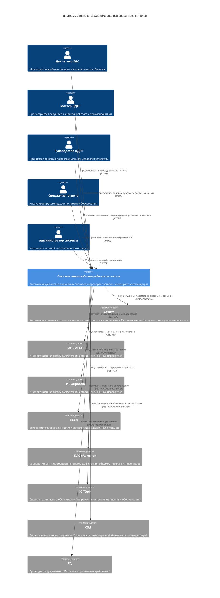
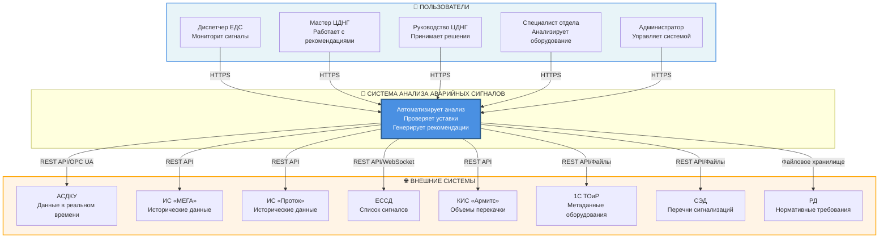

# C4 МОДЕЛЬ: УРОВЕНЬ КОНТЕКСТА (CONTEXT)

**Версия:** 1.0  
**Дата:** 2025  
**Статус:** Проектирование

---

## Диаграмма контекста системы

Диаграмма показывает систему анализа аварийных сигналов в контексте её окружения - пользователей и внешних систем, с которыми она взаимодействует.

### Mermaid диаграмма (C4Context - требует плагина)



**Примечание:** Для отображения этой диаграммы требуется плагин Mermaid C4 или специальный рендерер. Если плагин недоступен, используйте альтернативные форматы ниже.

### Альтернативная Mermaid диаграмма (стандартный синтаксис)



---

## Описание взаимодействий

### Пользователи системы

#### 1. Диспетчер ЕДС
- **Роль:** Мониторинг аварийных сигналов
- **Взаимодействие:**
  - Просматривает дашборд с текущими тревогами
  - Запускает анализ объектов
  - Просматривает результаты анализа
  - Получает уведомления о новых тревогах

#### 2. Мастер ЦДНГ
- **Роль:** Оперативное управление объектами
- **Взаимодействие:**
  - Просматривает результаты анализа объектов
  - Работает с рекомендациями
  - Принимает/отклоняет рекомендации
  - Просматривает статистику по объектам

#### 3. Руководство ЦДНГ
- **Роль:** Принятие решений
- **Взаимодействие:**
  - Принимает решения по рекомендациям
  - Управляет уставками сигнализаций
  - Просматривает сводные отчеты
  - Получает уведомления о критичных рекомендациях

#### 4. Специалист отдела
- **Роль:** Анализ и планирование
- **Взаимодействие:**
  - Анализирует рекомендации по замене оборудования
  - Просматривает прогнозы и тренды
  - Формирует планы работ

#### 5. Администратор системы
- **Роль:** Управление системой
- **Взаимодействие:**
  - Управляет пользователями и правами
  - Настраивает интеграции с внешними системами
  - Мониторит работу системы
  - Настраивает параметры алгоритмов

### Внешние системы

#### 1. АСДКУ (Автоматизированная система диспетчерского контроля и управления)
- **Назначение:** Источник данных параметров в реальном времени
- **Данные:**
  - Текущие значения параметров (давление, уровень, температура)
  - Состояние оборудования (работает/остановлено)
  - История изменений параметров
  - Список аварийных сигналов
- **Интеграция:** REST API, OPC UA, WebSocket
- **Частота:** Реальное время или каждые 1-5 минут

#### 2. ИС «МЕГА»
- **Назначение:** Источник исторических данных параметров
- **Данные:**
  - Исторические данные параметров
  - Тренды
  - Метаданные объектов
- **Интеграция:** REST API
- **Частота:** Ежедневно или по запросу

#### 3. ИС «Проток»
- **Назначение:** Источник исторических данных параметров
- **Данные:**
  - Исторические данные параметров
  - Тренды
  - Метаданные объектов
- **Интеграция:** REST API
- **Частота:** Ежедневно или по запросу

#### 4. ЕССД (Единая система сбора данных)
- **Назначение:** Источник списка аварийных сигналов
- **Данные:**
  - Список аварийных сигналов
  - Метаданные сигналов (объект, параметр, время)
- **Интеграция:** REST API, WebSocket
- **Частота:** Реальное время или каждые 5-15 минут

#### 5. КИС «Армитс»
- **Назначение:** Источник данных о перекачке и прогнозах
- **Данные:**
  - Объемы перекачки жидкости
  - Прогнозы добычи
  - Метаданные оборудования (марка, модель)
- **Интеграция:** REST API
- **Частота:** Ежедневно

#### 6. 1С ТОиР
- **Назначение:** Источник метаданных оборудования
- **Данные:**
  - Метаданные оборудования (марка, модель, паспортные данные)
  - История обслуживания
  - Сроки эксплуатации
- **Интеграция:** REST API, 1C:Enterprise API, файловый обмен
- **Частота:** Ежедневно или по запросу

#### 7. СЭД (Система электронного документооборота)
- **Назначение:** Источник перечней блокировок и сигнализаций
- **Данные:**
  - Перечни блокировок и сигнализаций (PDF)
  - Документы согласования
- **Интеграция:** REST API, файловый обмен
- **Частота:** По запросу или при изменении документов

#### 8. РД (Руководящие документы)
- **Назначение:** Источник нормативных требований
- **Данные:**
  - Нормативные требования (PDF)
  - Требования ФНиП
- **Интеграция:** Файловое хранилище
- **Частота:** При обновлении документов

---

## Альтернативные форматы диаграммы

### PlantUML формат

```plantuml
@startuml C4_Context
!include https://raw.githubusercontent.com/plantuml-stdlib/C4-PlantUML/master/C4_Context.puml

LAYOUT_WITH_LEGEND()

title Диаграмма контекста: Система анализа аварийных сигналов

Person(dispatcher, "Диспетчер ЕДС", "Мониторит аварийные сигналы, запускает анализ объектов")
Person(master, "Мастер ЦДНГ", "Просматривает результаты анализа, работает с рекомендациями")
Person(manager, "Руководство ЦДНГ", "Принимает решения по рекомендациям, управляет уставками")
Person(specialist, "Специалист отдела", "Анализирует рекомендации по замене оборудования")
Person(admin, "Администратор системы", "Управляет системой, настраивает интеграции")

System(system, "Система анализа аварийных сигналов", "Автоматизирует анализ аварийных сигналов, проверяет уставки, генерирует рекомендации")

System_Ext(asdku, "АСДКУ", "Автоматизированная система диспетчерского контроля и управления")
System_Ext(mega, "ИС «МЕГА»", "Информационная система")
System_Ext(protok, "ИС «Проток»", "Информационная система")
System_Ext(essd, "ЕССД", "Единая система сбора данных")
System_Ext(armits, "КИС «Армитс»", "Корпоративная информационная система")
System_Ext(toir, "1С ТОиР", "Система технического обслуживания и ремонта")
System_Ext(sed, "СЭД", "Система электронного документооборота")
System_Ext(rd, "РД", "Руководящие документы")

Rel(dispatcher, system, "Просматривает дашборд, запускает анализ", "HTTPS")
Rel(master, system, "Просматривает результаты анализа", "HTTPS")
Rel(manager, system, "Принимает решения по рекомендациям", "HTTPS")
Rel(specialist, system, "Анализирует рекомендации", "HTTPS")
Rel(admin, system, "Управляет системой", "HTTPS")

Rel(system, asdku, "Получает данные параметров", "REST API/OPC UA")
Rel(system, mega, "Получает исторические данные", "REST API")
Rel(system, protok, "Получает исторические данные", "REST API")
Rel(system, essd, "Получает список сигналов", "REST API/WebSocket")
Rel(system, armits, "Получает объемы перекачки", "REST API")
Rel(system, toir, "Получает метаданные оборудования", "REST API")
Rel(system, sed, "Получает перечни сигнализаций", "REST API")
Rel(system, rd, "Читает нормативные требования", "Файловое хранилище")

@enduml
```

### Текстовая диаграмма (ASCII)

```
┌─────────────────────────────────────────────────────────────────────┐
│                    ПОЛЬЗОВАТЕЛИ СИСТЕМЫ                             │
├─────────────────────────────────────────────────────────────────────┤
│                                                                     │
│  ┌──────────────┐  ┌──────────────┐  ┌──────────────┐           │
│  │ Диспетчер    │  │ Мастер       │  │ Руководство  │           │
│  │ ЕДС          │  │ ЦДНГ         │  │ ЦДНГ         │           │
│  └──────┬───────┘  └──────┬───────┘  └──────┬───────┘           │
│         │                 │                  │                    │
│         └─────────────────┴──────────────────┘                    │
│                           │                                        │
│  ┌──────────────┐  ┌──────┴───────┐                               │
│  │ Специалист  │  │ Администратор│                               │
│  │ отдела      │  │ системы      │                               │
│  └──────┬───────┘  └──────┬───────┘                               │
│         │                 │                                        │
│         └─────────────────┘                                        │
│                           │                                        │
│                           ▼                                        │
│         ┌─────────────────────────────────────┐                    │
│         │  СИСТЕМА АНАЛИЗА АВАРИЙНЫХ СИГНАЛОВ │                    │
│         │                                     │                    │
│         │  Автоматизирует анализ аварийных    │                    │
│         │  сигналов, проверяет уставки,       │                    │
│         │  генерирует рекомендации            │                    │
│         └─────────────────────────────────────┘                    │
│                           │                                        │
│         ┌─────────────────┼─────────────────┐                      │
│         │                 │                 │                      │
│         ▼                 ▼                 ▼                      │
│  ┌──────────────┐  ┌──────────────┐  ┌──────────────┐          │
│  │   АСДКУ      │  │ ИС «МЕГА»    │  │ ИС «Проток»  │          │
│  │   ЕССД       │  │              │  │              │          │
│  └──────────────┘  └──────────────┘  └──────────────┘          │
│                                                                     │
│  ┌──────────────┐  ┌──────────────┐  ┌──────────────┐          │
│  │ КИС «Армитс» │  │   1С ТОиР     │  │     СЭД      │          │
│  │              │  │              │  │     РД       │          │
│  └──────────────┘  └──────────────┘  └──────────────┘          │
│                                                                     │
└─────────────────────────────────────────────────────────────────────┘
```

---

## Легенда

### Типы элементов

- **Person** - Пользователь системы (человек)
- **System** - Система анализа аварийных сигналов (наша система)
- **System_Ext** - Внешняя система (система, которой мы не владеем)

### Типы связей

- **HTTPS** - Взаимодействие через веб-интерфейс
- **REST API** - Интеграция через REST API
- **OPC UA** - Интеграция через OPC UA протокол
- **WebSocket** - Интеграция через WebSocket для реального времени
- **Файловый обмен** - Интеграция через файловый обмен
- **Файловое хранилище** - Чтение из файлового хранилища

---

## Примечания

1. **Масштабируемость:** Диаграмма показывает систему на уровне контекста. Детали внутренней архитектуры системы показаны на уровне контейнеров (Container level).

2. **Интеграции:** Все внешние системы интегрируются с нашей системой через различные протоколы в зависимости от их возможностей.

3. **Пользователи:** Пять основных ролей пользователей взаимодействуют с системой через веб-интерфейс (HTTPS).

4. **Данные:** Система получает данные из 8 внешних систем для выполнения анализа и генерации рекомендаций.

---

**Следующий уровень:** [Container Level (Уровень контейнеров)](./Phase-1-C4-Container.md) - детализация внутренней архитектуры системы

