# ПРЕЗЕНТАЦИЯ: СИСТЕМА АНАЛИЗА АВАРИЙНЫХ СИГНАЛОВ

**Этап 1: Алгоритмическая система**  
**Версия:** 1.0  
**Дата:** 2025

---

## Слайд 1: Проблематика

### Масштаб проблемы

**~60,000 аварийных сигналов в неделю**

```
111,950 → 59,974 сигналов/неделя
Снижение на 46% за год
```

### Основные причины ложных тревог

| Причина | Влияние |
|---------|---------|
| Неверные уставки | 40% |
| Изменение режимов работы | 25% |
| Износ оборудования | 20% |
| Выведенное оборудование | 15% |

### Текущий процесс

- Ручной анализ каждого сигнала
- Проверка трендов вручную
- Сопоставление с уставками вручную
- **Время анализа: несколько часов на объект**

### Цель проекта

Автоматизировать анализ и снизить количество ложных тревог

### Диаграмма: Текущий процесс

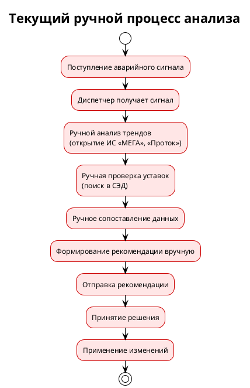

---

## Слайд 2: Фазовый подход к решению

### Итерационная реализация

**Поэтапное внедрение с накоплением данных**

```
┌─────────────────────────────────────────┐
│  ФАЗА 1: Алгоритмическая система        │
│  ─────────────────────────────────────  │
│  • Детерминированные алгоритмы          │
│  • Анализ трендов и уставок             │
│  • Генерация рекомендаций               │
│  • Сбор статистических данных           │
└─────────────────────────────────────────┘
                     ↓
┌─────────────────────────────────────────┐
│  ФАЗА 2: Система с ИИ                   │
│  ─────────────────────────────────────  │
│  • Машинное обучение на собранных       │
│    данных                               │
│  • Прогнозирование отказов              │
│  • Самообучающиеся алгоритмы            │
└─────────────────────────────────────────┘
```

### Фаза 1: Результат

**Интерфейсы для пользователей:**

| Роль | Интерфейс |
|------|-----------|
| Диспетчер ЕДС | Дашборд с текущими тревогами |
| Мастер ЦДНГ | Результаты анализа объектов |
| Руководство ЦДНГ | Управление уставками и рекомендациями |
| Специалист | Анализ рекомендаций по оборудованию |

**Что получаем:**
- Веб-интерфейс для работы с системой
- API для интеграций
- Мобильное приложение (опционально)
- Отчеты и аналитика

### Преимущества подхода

✅ Быстрый старт (без обучения моделей)  
✅ Накопление данных для ИИ  
✅ Снижение тревог уже на первой фазе  
✅ Готовые интерфейсы для пользователей

### Диаграмма: Фазовый подход

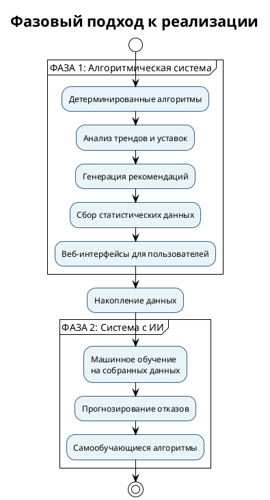

---

## Слайд 3: Use Case - Поступление сигнала и анализ

### Пример: "Высокое давление на приеме насоса Н-1"

**Объект:** ДНС-123 (НГДУ-1)  
**Время:** 15.08.2025, 08:30

### Этап 1: Поступление сигнала

```
ЕССД/АСДКУ → Система
"Аварийно-высокое давление: 0.42 МПа"
```

**Роль: Диспетчер ЕДС**
- Получает уведомление о сигнале
- Запускает анализ объекта через интерфейс

### Этап 2: Автоматический анализ

**Масштаб анализа:**
- Анализ запускается для **группы объектов** (по НГДУ, типу объектов)
- Пример: все ДНС НГДУ-1 или топ-10 проблемных объектов
- **Один объект:** ~30 секунд
- **Группа объектов (10-20):** ~5-10 минут

**Горизонтальное масштабирование:**
- Параллельная обработка объектов
- Распределение нагрузки между серверами
- Масштабирование под нагрузку

**Система автоматически:**
1. Собирает данные из внешних систем
   - Исторические данные (ИС «МЕГА», «Проток»)
   - Объемы перекачки (КИС «Армитс»)
   - Метаданные оборудования (1С ТОиР)
   - Текущие уставки (СЭД)

2. Выполняет анализ (параллельно для группы):
   - Анализ трендов (2 месяца)
   - Проверка соответствия уставок
   - Проверка состояния оборудования

**Результат:** Проблемы выявлены автоматически для всех объектов группы

### Диаграмма: Процесс поступления сигнала и анализа

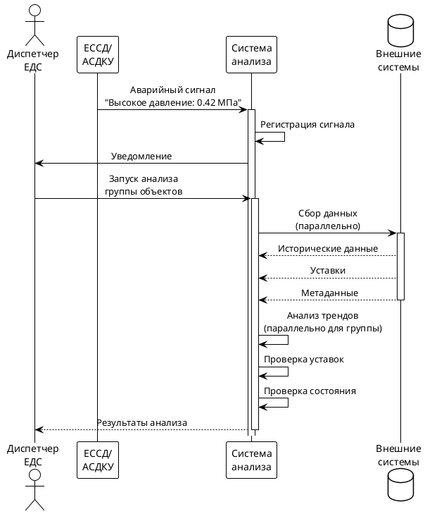

---

## Слайд 4: Алгоритм вычисления рекомендации

### Шаг 1: Анализ трендов

**Расчет статистики за 2 месяца:**

| Параметр | Текущий месяц | Предыдущий месяц | Изменение |
|----------|---------------|------------------|-----------|
| Среднее | 0.34 МПа | 0.33 МПа | +3% |
| Минимум | 0.30 МПа | 0.28 МПа | +7% |
| **Максимум** | **0.42 МПа** | 0.40 МПа | +5% |

**Вывод:** Давление стабильно, незначительный рост

### Шаг 2: Проверка соответствия уставок

**Сравнение фактических параметров с уставками:**

```
Фактический максимум: 0.42 МПа
Текущая уставка:      0.40 МПа
───────────────────────────────
Несоответствие:        -0.02 МПа (уставка ниже!)
```

**Проверка допустимых значений:**
- Допустимый максимум (паспорт): 0.6 МПа ✅
- Фактическое значение в пределах нормы ✅

### Шаг 3: Расчет рекомендуемой уставки

**Формула расчета:**

```
Рекомендуемая уставка = Фактический максимум × (1 + Запас безопасности)
                       = 0.42 МПа × 1.10
                       = 0.46 МПа
```

**Учет факторов:**
- Запас безопасности: 10%
- Прогноз роста объемов: +20% → давление может вырасти
- Нормативные требования: соблюдены

### Шаг 4: Определение приоритета и адресата

**Приоритет: Высокий**
- Уставка ниже фактического значения
- Регулярные ложные сработки (265/неделю)
- Влияние на производство

**Адресат: Руководство ЦДНГ**
- Требуется решение по изменению уставок
- Необходимо согласование с ООО «ПЦ»

### Диаграмма: Алгоритм вычисления рекомендации

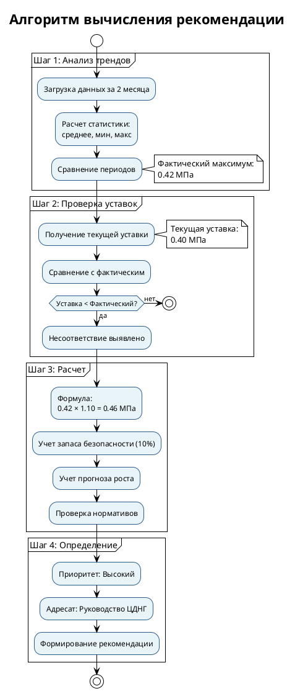

---

## Слайд 5: Use Case - Результаты и рекомендации

### Сгенерированная рекомендация

**"Увеличить уставку с 0.40 до 0.46 МПа"**

**Краткое обоснование:**
- Фактический максимум: 0.42 МПа
- Текущая уставка: 0.40 МПа (ниже фактического)
- Рекомендуемая: 0.46 МПа (с запасом 10%)
- Приоритет: **Высокий**

### Уведомления пользователям

**Роль: Мастер ЦДНГ**
- Получает email с результатами анализа
- Просматривает детали в веб-интерфейсе

**Роль: Руководство ЦДНГ**
- Получает email о рекомендации высокого приоритета

### Диаграмма: Уведомления пользователям

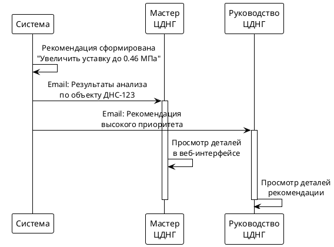

---

## Слайд 6: Use Case - Принятие решения и применение

### Просмотр и принятие решения

**Роль: Мастер ЦДНГ**
- Изучает результаты анализа в интерфейсе
- Просматривает графики и статистику
- Информирует руководство

**Роль: Руководство ЦДНГ**
- Просматривает детали рекомендации
- Изучает обоснование
- **Принимает решение:** ✅ Принять рекомендацию

### Применение рекомендации

**Роль: Руководство ЦДНГ**
- Формирует заявку для ООО «ПЦ»
- Указывает новые значения уставок

**Роль: ООО «ПЦ»**
- Изменяет уставки в АСУТП
- 0.40 МПа → **0.46 МПа**

**Роль: Система**
- Обновляет уставки в базе данных
- Отслеживает статус рекомендации

### Диаграмма: Процесс принятия решения и применения

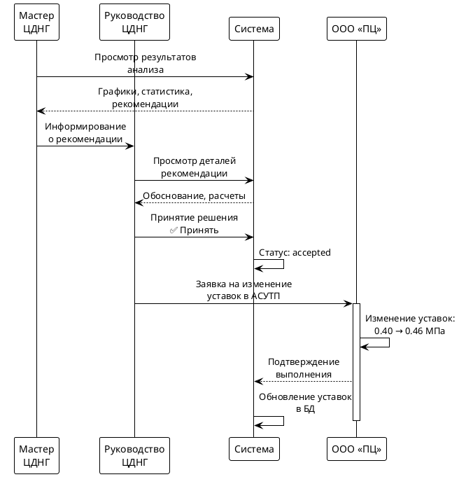

---

## Слайд 7: Use Case - Результаты и эффективность

### Мониторинг эффективности

**Период проверки:** 1-2 недели после применения

| Метрика | До применения | После применения | Результат |
|---------|---------------|------------------|-----------|
| Сработок в неделю | 265 | 15 | **↓ 94%** |
| Ложные тревоги | 250 | 0 | **↓ 100%** |

### Итоги успешного use case

**Время обработки:**
- Ручной анализ: **несколько часов** (на группу объектов)
- Автоматический анализ: **5-10 минут** (на группу объектов)
- **Ускорение:** в 10-20 раз

**Результаты:**
- ✅ Проблема выявлена автоматически
- ✅ Рекомендация сформирована с обоснованием
- ✅ Решение принято на основе данных
- ✅ Эффективность подтверждена

**Роли, участвовавшие в процессе:**
1. **Диспетчер ЕДС** - запустил анализ
2. **Система** - выполнила автоматический анализ
3. **Мастер ЦДНГ** - изучил результаты
4. **Руководство ЦДНГ** - принял решение
5. **ООО «ПЦ»** - применил изменения

### Диаграмма: Результаты и эффективность

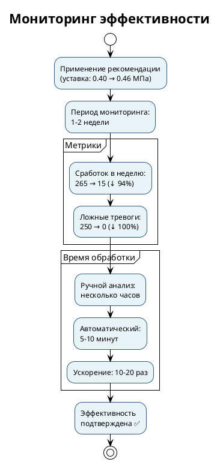

---

## Слайд 8: Отказоустойчивость и стабильность системы

### Архитектурные решения для надежности

**1. Горизонтальное масштабирование**
- Множественные экземпляры сервисов
- Автоматическое масштабирование под нагрузку
- Распределение нагрузки между серверами
- **Результат:** Система выдерживает пиковые нагрузки

**2. Резервирование компонентов**
- Репликация баз данных (master-slave)
- Резервные копии данных
- Избыточность сервисов
- **Результат:** Отказ одного компонента не останавливает систему

**3. Обработка ошибок и retry**
- Автоматические повторы при сбоях внешних систем
- Circuit breaker для защиты от каскадных отказов
- Graceful degradation (деградация с сохранением функциональности)
- **Результат:** Система продолжает работать при сбоях интеграций

**4. Асинхронная обработка**
- Очереди задач для длительных операций
- Фоновые процессы для анализа
- Неблокирующая обработка запросов
- **Результат:** Высокая отзывчивость интерфейсов

**5. Кэширование данных**
- Кэш часто запрашиваемых данных
- Снижение нагрузки на внешние системы
- Быстрый отклик для пользователей
- **Результат:** Стабильная производительность

**6. Мониторинг и алертинг**
- Отслеживание состояния всех компонентов
- Автоматические уведомления о проблемах
- Метрики производительности
- **Результат:** Быстрое выявление и устранение проблем

### Гарантии стабильности

✅ **Доступность:** 99.5% uptime  
✅ **Производительность:** Обработка до 1000 объектов параллельно  
✅ **Масштабируемость:** Автоматическое добавление ресурсов  
✅ **Восстановление:** Автоматический перезапуск упавших сервисов

### Диаграмма: Архитектура отказоустойчивости

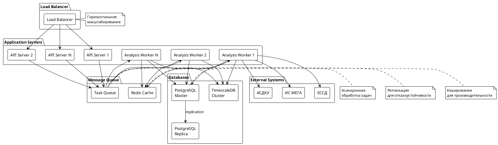

---

## Слайд 9: Фаза 1 - План реализации

### Сроки реализации: 9-12 месяцев

| Этап | Длительность | Описание |
|------|--------------|----------|
| **Анализ и проектирование** | 3-5 недель | Детализация требований, техническое проектирование |
| **Разработка инфраструктуры** | 5-6 недель | БД, интеграции, базовое API |
| **Разработка алгоритмов** | 6-8 недель | Trend Analyzer, Threshold Validator, Recommendation Generator |
| **Разработка интерфейсов** | 6-8 недель | Веб-интерфейс, дашборды, страницы анализа |
| **Интеграция и тестирование** | 5-6 недель | Интеграционное тестирование, приемочное тестирование |
| **Пилотное внедрение** | 9-12 недель | Пилот на 5-10 объектах, доработка |
| **Развертывание** | 6-9 недель | Масштабирование на все объекты ДНС, ГЗНУ |

### Команда проекта

| Роль | Количество | Обязанности |
|------|------------|-------------|
| **Аналитики** | 2 | Анализ требований, проектирование процессов |
| **Дизайнеры** | 1-2 | Дизайн интерфейсов, UX/UI |
| **Backend разработчики** | 3-4 | Разработка API, алгоритмов, интеграций |
| **Frontend разработчики** | 2-3 | Разработка веб-интерфейса |
| **QA/Тестировщики** | 2 | Модульное, интеграционное, системное тестирование |
| **DevOps инженеры** | 2 | Инфраструктура, CI/CD, мониторинг, развертывание |
| **Автоматические тестировщики** | 1-2 | Настройка автоматических тестов, E2E тесты |
| **Менеджер проекта** | 1 | Управление проектом, координация |

### Технологический стек

**Backend:**
- Python 3.11+, FastAPI, Celery
- PostgreSQL 15+, TimescaleDB, Redis
- Pandas, NumPy, SciPy

**Frontend:**
- React 18+, TypeScript 5+
- Material-UI, Chart.js/Recharts
- React Query, React Hook Form

**Инфраструктура:**
- Docker, Docker Compose
- Kubernetes (опционально)
- Nginx, Prometheus, Grafana
- GitLab CI/CD

**Тестирование:**
- pytest (Python)
- Jest, React Testing Library (Frontend)
- Playwright/Cypress (E2E)
- k6 (нагрузочное тестирование)

### Обоснование выбора технологического стека

**Backend - Python:**
- ✅ Лучшие библиотеки для аналитики (Pandas, NumPy, SciPy)
- ✅ Плавный переход к ML на Фазе 2 (scikit-learn, TensorFlow)
- ✅ Отличные инструменты для парсинга PDF документов
- ✅ Хорошая поддержка OPC UA интеграций

**Базы данных:**
- ✅ **TimescaleDB** - специализированная БД для временных рядов
- ✅ **PostgreSQL** - надежная реляционная БД с отличной поддержкой
- ✅ **Redis** - быстрый кэш и очереди задач

**Frontend - React + TypeScript:**
- ✅ Современный стек с большой экосистемой
- ✅ TypeScript для надежности и масштабируемости
- ✅ Material-UI для быстрой разработки корпоративных интерфейсов
- ✅ Chart.js/Recharts для визуализации временных рядов

**Инфраструктура:**
- ✅ **Docker/Kubernetes** - стандарт для масштабируемости и отказоустойчивости
- ✅ **Prometheus/Grafana** - отраслевой стандарт мониторинга
- ✅ **GitLab CI/CD** - интеграция с процессом разработки

### Диаграмма: Этапы разработки Фазы 1

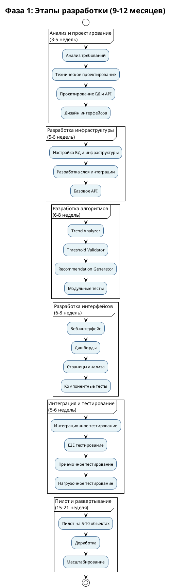

---

## Слайд 10: Фаза 2 - План реализации

### Сроки реализации: 6-9 месяцев

| Этап | Длительность | Описание |
|------|--------------|----------|
| **Анализ данных и подготовка** | 5-6 недель | Анализ накопленных данных, подготовка датасетов |
| **Проектирование ML-моделей** | 3-5 недель | Проектирование архитектуры моделей, выбор алгоритмов |
| **Разработка ML-инфраструктуры** | 5-6 недель | ML Pipeline, обучение моделей, версионирование |
| **Разработка моделей** | 9-12 недель | Обучение моделей, валидация, оптимизация |
| **Интеграция ML в систему** | 5-6 недель | Интеграция моделей в существующую систему |
| **Тестирование и валидация** | 5-6 недель | Тестирование моделей, A/B тестирование |
| **Пилотное внедрение** | 6-9 недель | Пилот с ML-моделями, доработка |
| **Развертывание** | 3-5 недель | Масштабирование ML-моделей |

### Команда проекта

| Роль | Количество | Обязанности |
|------|------------|-------------|
| **Data Scientists** | 2-3 | Разработка ML-моделей, анализ данных |
| **ML Engineers** | 2 | ML Pipeline, развертывание моделей |
| **Backend разработчики** | 2-3 | Интеграция ML в систему |
| **QA/Тестировщики** | 1-2 | Тестирование моделей, валидация |
| **DevOps инженеры** | 1-2 | ML инфраструктура, мониторинг моделей |
| **Автоматические тестировщики** | 1 | Автоматизация тестирования ML |
| **Менеджер проекта** | 1 | Управление проектом |

### Технологический стек

**ML/AI:**
- Python 3.11+, scikit-learn
- TensorFlow/PyTorch (для глубокого обучения)
- MLflow (управление ML lifecycle)
- Pandas, NumPy для обработки данных

**ML Infrastructure:**
- Kubeflow или MLflow
- DVC (версионирование данных)
- Weights & Biases (эксперименты)
- Apache Airflow (оркестрация)

**Backend (расширение):**
- FastAPI (ML endpoints)
- Celery (асинхронная обработка)
- Redis (кэширование моделей)

**Мониторинг ML:**
- Prometheus (метрики моделей)
- Grafana (визуализация)
- Evidently AI (мониторинг дрифта данных)

**Тестирование:**
- pytest, pytest-ml
- Great Expectations (валидация данных)
- Model validation frameworks

### Обоснование выбора технологического стека

**ML/AI - Python экосистема:**
- ✅ **scikit-learn** - стандарт для классического ML, отличная документация
- ✅ **TensorFlow/PyTorch** - лидеры в глубоком обучении, большой выбор моделей
- ✅ **Pandas, NumPy** - уже используются в Фазе 1, преемственность стека
- ✅ Единый язык для всего проекта (backend + ML)

**ML Infrastructure:**
- ✅ **MLflow** - управление ML lifecycle, эксперименты, версионирование моделей
- ✅ **Kubeflow** - оркестрация ML workflows в Kubernetes (если используется K8s)
- ✅ **DVC** - версионирование данных и моделей, интеграция с Git
- ✅ **Weights & Biases** - отслеживание экспериментов, визуализация

**Интеграция с существующей системой:**
- ✅ Использование тех же технологий (Python, FastAPI, PostgreSQL)
- ✅ Минимальные изменения в архитектуре
- ✅ Переиспользование инфраструктуры (Kubernetes, мониторинг)

**Мониторинг ML:**
- ✅ **Evidently AI** - специализированный инструмент для мониторинга дрифта данных
- ✅ **Prometheus/Grafana** - уже используются, единая система мониторинга

### Диаграмма: Этапы разработки Фазы 2

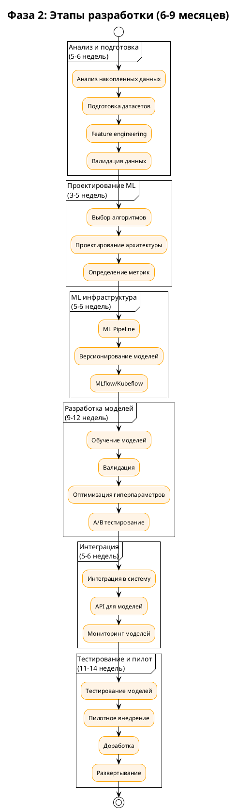

---

## Слайд 11: Автоматизация тестирования и DevOps

### Автоматические тестировщики

**Обязанности:**
- Настройка и поддержка CI/CD пайплайнов
- Автоматизация E2E тестов (Playwright/Cypress)
- Нагрузочное тестирование (k6, Locust)
- Интеграция тестов в процесс разработки

**Инструменты:**
- Playwright/Cypress для E2E
- k6 для нагрузочного тестирования
- pytest, Jest для автоматических тестов
- GitLab CI/CD / GitHub Actions

### DevOps инженеры

**Обязанности:**
- Настройка инфраструктуры (Docker, Kubernetes)
- Настройка CI/CD пайплайнов
- Мониторинг и алертинг (Prometheus, Grafana)
- Управление конфигурациями
- Резервное копирование и восстановление

**Инструменты:**
- Docker, Docker Compose, Kubernetes
- Terraform (IaC)
- Ansible (конфигурация)
- GitLab CI/CD, Jenkins
- Prometheus, Grafana, ELK Stack

### Процесс CI/CD

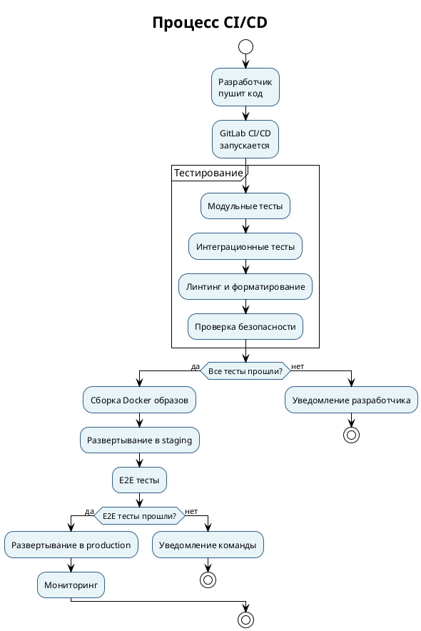

### Метрики качества

✅ **Покрытие тестами:** > 80%  
✅ **Автоматизация тестов:** 100% критичных сценариев  
✅ **Время сборки:** < 10 минут  
✅ **Время развертывания:** < 30 минут  
✅ **Частота развертываний:** Еженедельно

---

