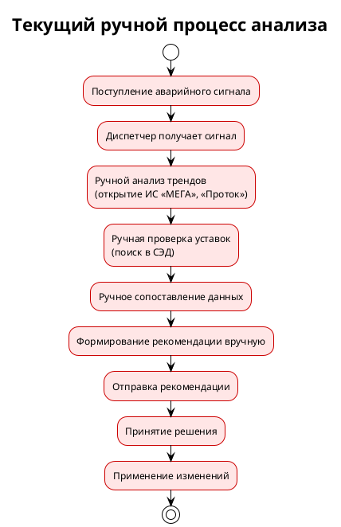
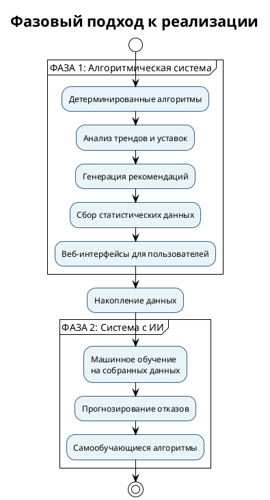
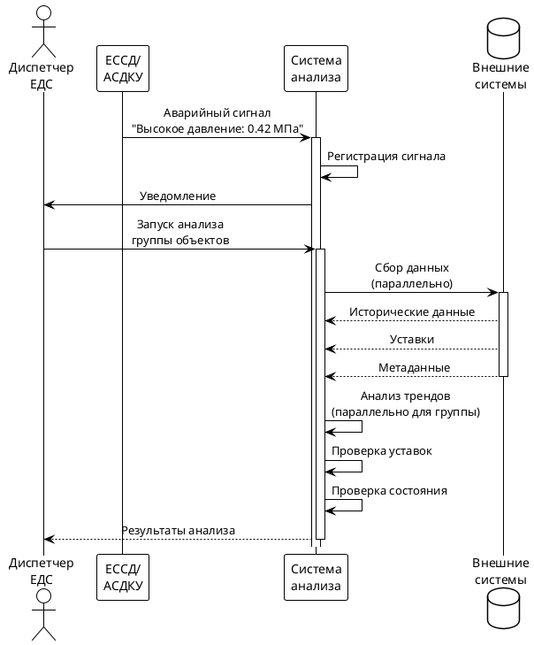
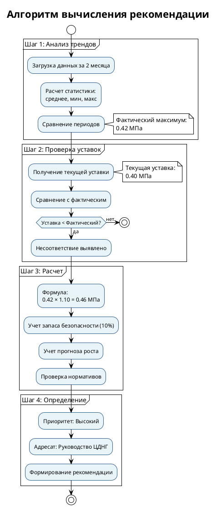
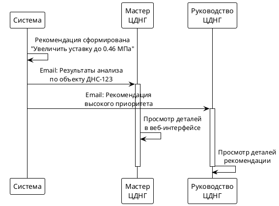
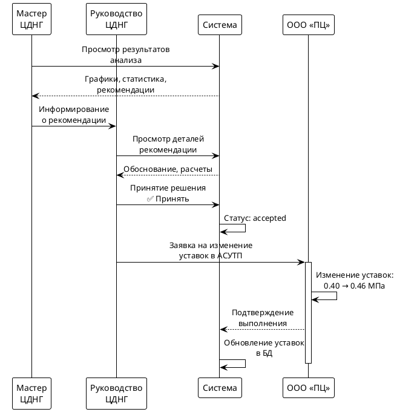
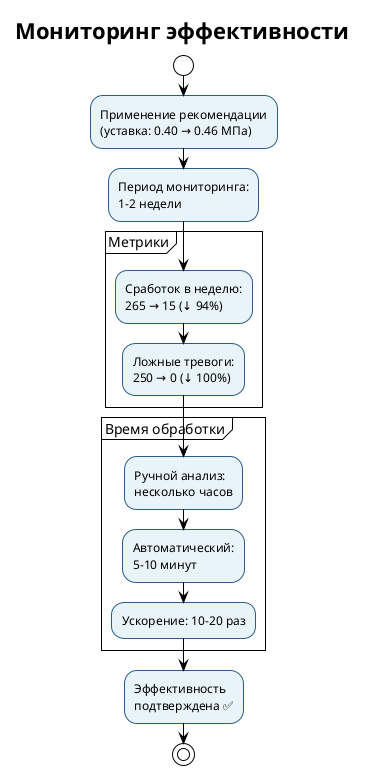

# ПРЕЗЕНТАЦИЯ: СИСТЕМА АНАЛИЗА АВАРИЙНЫХ СИГНАЛОВ

**Этап 1: Алгоритмическая система**  
**Версия:** 1.0  
**Дата:** 2025

---

## Слайд 1: Проблематика

### Масштаб проблемы

**~60,000 аварийных сигналов в неделю**

```
111,950 → 59,974 сигналов/неделя
Снижение на 46% за год
```

### Основные причины ложных тревог

| Причина | Влияние |
|---------|---------|
| Неверные уставки | 40% |
| Изменение режимов работы | 25% |
| Износ оборудования | 20% |
| Выведенное оборудование | 15% |

### Текущий процесс

- Ручной анализ каждого сигнала
- Проверка трендов вручную
- Сопоставление с уставками вручную
- **Время анализа: несколько часов на объект**

### Цель проекта

Автоматизировать анализ и снизить количество ложных тревог

### Диаграмма: Текущий процесс



---

## Слайд 2: Фазовый подход к решению

### Итерационная реализация

**Поэтапное внедрение с накоплением данных**

```
┌─────────────────────────────────────────┐
│  ФАЗА 1: Алгоритмическая система        │
│  ─────────────────────────────────────  │
│  • Детерминированные алгоритмы          │
│  • Анализ трендов и уставок             │
│  • Генерация рекомендаций               │
│  • Сбор статистических данных           │
└─────────────────────────────────────────┘
                     ↓
┌─────────────────────────────────────────┐
│  ФАЗА 2: Система с ИИ                   │
│  ─────────────────────────────────────  │
│  • Машинное обучение на собранных       │
│    данных                               │
│  • Прогнозирование отказов              │
│  • Самообучающиеся алгоритмы            │
└─────────────────────────────────────────┘
```

### Фаза 1: Результат

**Интерфейсы для пользователей:**

| Роль | Интерфейс |
|------|-----------|
| Диспетчер ЕДС | Дашборд с текущими тревогами |
| Мастер ЦДНГ | Результаты анализа объектов |
| Руководство ЦДНГ | Управление уставками и рекомендациями |
| Специалист | Анализ рекомендаций по оборудованию |

**Что получаем:**
- Веб-интерфейс для работы с системой
- API для интеграций
- Мобильное приложение (опционально)
- Отчеты и аналитика

### Преимущества подхода

✅ Быстрый старт (без обучения моделей)  
✅ Накопление данных для ИИ  
✅ Снижение тревог уже на первой фазе  
✅ Готовые интерфейсы для пользователей

### Диаграмма: Фазовый подход



---

## Слайд 3: Use Case - Поступление сигнала и анализ

### Пример: "Высокое давление на приеме насоса Н-1"

**Объект:** ДНС-123 (НГДУ-1)  
**Время:** 15.08.2025, 08:30

### Этап 1: Поступление сигнала

```
ЕССД/АСДКУ → Система
"Аварийно-высокое давление: 0.42 МПа"
```

**Роль: Диспетчер ЕДС**
- Получает уведомление о сигнале
- Запускает анализ объекта через интерфейс

### Этап 2: Автоматический анализ

**Масштаб анализа:**
- Анализ запускается для **группы объектов** (по НГДУ, типу объектов)
- Пример: все ДНС НГДУ-1 или топ-10 проблемных объектов
- **Один объект:** ~30 секунд
- **Группа объектов (10-20):** ~5-10 минут

**Горизонтальное масштабирование:**
- Параллельная обработка объектов
- Распределение нагрузки между серверами
- Масштабирование под нагрузку

**Система автоматически:**
1. Собирает данные из внешних систем
   - Исторические данные (ИС «МЕГА», «Проток»)
   - Объемы перекачки (КИС «Армитс»)
   - Метаданные оборудования (1С ТОиР)
   - Текущие уставки (СЭД)

2. Выполняет анализ (параллельно для группы):
   - Анализ трендов (2 месяца)
   - Проверка соответствия уставок
   - Проверка состояния оборудования

**Результат:** Проблемы выявлены автоматически для всех объектов группы

### Диаграмма: Процесс поступления сигнала и анализа



---

## Слайд 4: Алгоритм вычисления рекомендации

### Шаг 1: Анализ трендов

**Расчет статистики за 2 месяца:**

| Параметр | Текущий месяц | Предыдущий месяц | Изменение |
|----------|---------------|------------------|-----------|
| Среднее | 0.34 МПа | 0.33 МПа | +3% |
| Минимум | 0.30 МПа | 0.28 МПа | +7% |
| **Максимум** | **0.42 МПа** | 0.40 МПа | +5% |

**Вывод:** Давление стабильно, незначительный рост

### Шаг 2: Проверка соответствия уставок

**Сравнение фактических параметров с уставками:**

```
Фактический максимум: 0.42 МПа
Текущая уставка:      0.40 МПа
───────────────────────────────
Несоответствие:        -0.02 МПа (уставка ниже!)
```

**Проверка допустимых значений:**
- Допустимый максимум (паспорт): 0.6 МПа ✅
- Фактическое значение в пределах нормы ✅

### Шаг 3: Расчет рекомендуемой уставки

**Формула расчета:**

```
Рекомендуемая уставка = Фактический максимум × (1 + Запас безопасности)
                       = 0.42 МПа × 1.10
                       = 0.46 МПа
```

**Учет факторов:**
- Запас безопасности: 10%
- Прогноз роста объемов: +20% → давление может вырасти
- Нормативные требования: соблюдены

### Шаг 4: Определение приоритета и адресата

**Приоритет: Высокий**
- Уставка ниже фактического значения
- Регулярные ложные сработки (265/неделю)
- Влияние на производство

**Адресат: Руководство ЦДНГ**
- Требуется решение по изменению уставок
- Необходимо согласование с ООО «ПЦ»

### Диаграмма: Алгоритм вычисления рекомендации



---

## Слайд 5: Use Case - Результаты и рекомендации

### Сгенерированная рекомендация

**"Увеличить уставку с 0.40 до 0.46 МПа"**

**Краткое обоснование:**
- Фактический максимум: 0.42 МПа
- Текущая уставка: 0.40 МПа (ниже фактического)
- Рекомендуемая: 0.46 МПа (с запасом 10%)
- Приоритет: **Высокий**

### Уведомления пользователям

**Роль: Мастер ЦДНГ**
- Получает email с результатами анализа
- Просматривает детали в веб-интерфейсе

**Роль: Руководство ЦДНГ**
- Получает email о рекомендации высокого приоритета

### Диаграмма: Уведомления пользователям



---

## Слайд 6: Use Case - Принятие решения и применение

### Просмотр и принятие решения

**Роль: Мастер ЦДНГ**
- Изучает результаты анализа в интерфейсе
- Просматривает графики и статистику
- Информирует руководство

**Роль: Руководство ЦДНГ**
- Просматривает детали рекомендации
- Изучает обоснование
- **Принимает решение:** ✅ Принять рекомендацию

### Применение рекомендации

**Роль: Руководство ЦДНГ**
- Формирует заявку для ООО «ПЦ»
- Указывает новые значения уставок

**Роль: ООО «ПЦ»**
- Изменяет уставки в АСУТП
- 0.40 МПа → **0.46 МПа**

**Роль: Система**
- Обновляет уставки в базе данных
- Отслеживает статус рекомендации

### Диаграмма: Процесс принятия решения и применения



---

## Слайд 7: Use Case - Результаты и эффективность

### Мониторинг эффективности

**Период проверки:** 1-2 недели после применения

| Метрика | До применения | После применения | Результат |
|---------|---------------|------------------|-----------|
| Сработок в неделю | 265 | 15 | **↓ 94%** |
| Ложные тревоги | 250 | 0 | **↓ 100%** |

### Итоги успешного use case

**Время обработки:**
- Ручной анализ: **несколько часов** (на группу объектов)
- Автоматический анализ: **5-10 минут** (на группу объектов)
- **Ускорение:** в 10-20 раз

**Результаты:**
- ✅ Проблема выявлена автоматически
- ✅ Рекомендация сформирована с обоснованием
- ✅ Решение принято на основе данных
- ✅ Эффективность подтверждена

**Роли, участвовавшие в процессе:**
1. **Диспетчер ЕДС** - запустил анализ
2. **Система** - выполнила автоматический анализ
3. **Мастер ЦДНГ** - изучил результаты
4. **Руководство ЦДНГ** - принял решение
5. **ООО «ПЦ»** - применил изменения

### Диаграмма: Результаты и эффективность



---

