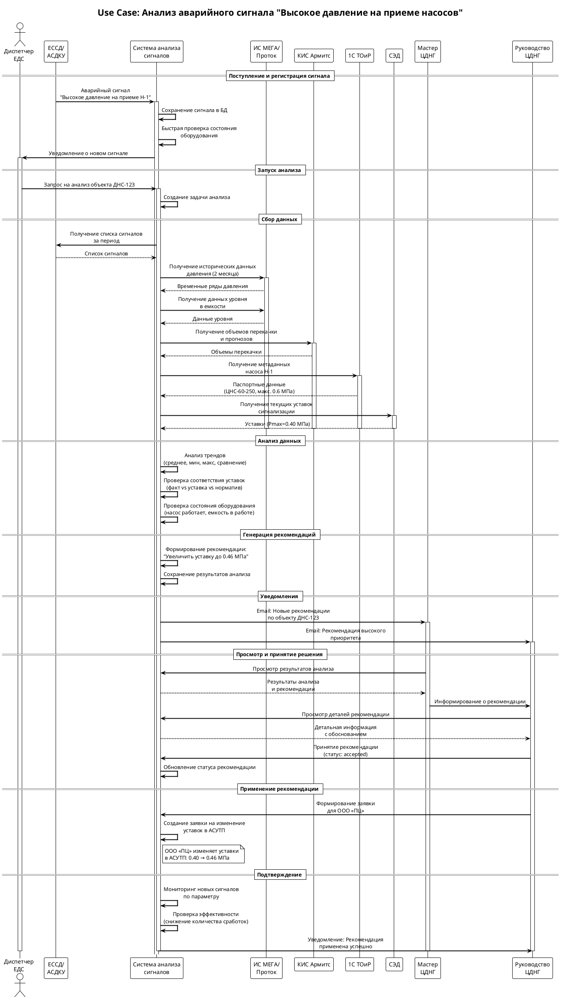
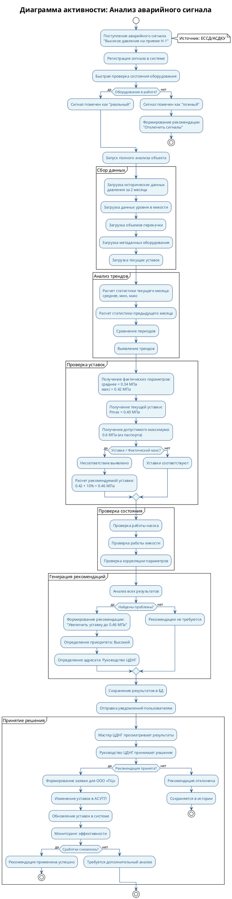
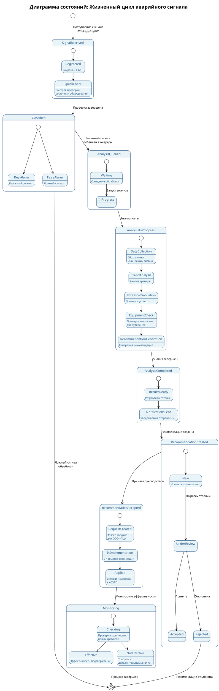

# ЭТАП 1: USE CASE - ЖИЗНЕННЫЙ ЦИКЛ АВАРИЙНОГО СИГНАЛА

**Версия:** 1.0  
**Дата:** 2025  
**Статус:** Проектирование

---

## Оглавление

1. [Описание Use Case](#описание-use-case)
2. [Диаграмма последовательности](#диаграмма-последовательности)
3. [Диаграмма активности](#диаграмма-активности)
4. [Диаграмма состояний](#диаграмма-состояний)
5. [Детальное описание этапов](#детальное-описание-этапов)
6. [Результаты и рекомендации](#результаты-и-рекомендации)

---

## Описание Use Case

### Название
**UC-001: Анализ и обработка аварийного сигнала "Высокое давление на приеме насосов"**

### Цель
Автоматический анализ аварийного сигнала о высоком давлении на приеме насоса, выявление причин сработки, проверка соответствия уставок и генерация рекомендаций по устранению проблемы.

### Контекст
- **Объект:** ДНС-123 (НГДУ-1)
- **Оборудование:** Насос Н-1 (модель ЦНС-60-250)
- **Параметр:** Давление на приеме насоса Н-1
- **Тип сигнала:** Аварийно-высокое давление
- **Период анализа:** Август 2025

### Участники
- **Диспетчер ЕДС** - получает сигнал, запускает анализ
- **Система анализа аварийных сигналов** - выполняет автоматический анализ
- **Мастер ЦДНГ** - просматривает результаты
- **Руководство ЦДНГ** - принимает решение по рекомендациям
- **Внешние системы:** ЕССД, АСДКУ, ИС «МЕГА», ИС «Проток», КИС «Армитс», 1С ТОиР, СЭД

### Предусловия
1. Система анализа аварийных сигналов развернута и работает
2. Настроены интеграции с внешними системами
3. В системе зарегистрированы объекты, оборудование и параметры
4. Настроены уставки сигнализаций

### Основной сценарий

1. **Поступление сигнала** - ЕССД/АСДКУ передает аварийный сигнал в систему
2. **Регистрация сигнала** - система сохраняет сигнал в базе данных
3. **Быстрая проверка** - система проверяет состояние оборудования
4. **Запуск анализа** - диспетчер ЕДС или система автоматически запускает анализ
5. **Сбор данных** - система собирает данные из внешних систем
6. **Анализ трендов** - анализ исторических данных параметров
7. **Проверка уставок** - сравнение фактических параметров с уставками
8. **Проверка состояния оборудования** - определение фактического состояния
9. **Генерация рекомендаций** - формирование рекомендаций по устранению проблемы
10. **Уведомление пользователей** - отправка уведомлений адресатам
11. **Просмотр результатов** - мастер ЦДНГ просматривает результаты
12. **Принятие решения** - руководство ЦДНГ принимает рекомендацию
13. **Применение рекомендации** - изменение уставок в АСУТП
14. **Подтверждение** - проверка эффективности примененной рекомендации

### Постусловия
1. Сигнал проанализирован и классифицирован
2. Сформированы рекомендации по устранению проблемы
3. Рекомендации применены (в случае принятия)
4. Уставки обновлены в системе
5. Снижено количество ложных сработок

---

## Диаграмма последовательности



---

## Диаграмма активности



---

## Диаграмма состояний



---

## Детальное описание этапов

### Этап 1: Поступление и регистрация сигнала

**Время:** T+0 минут

**Описание:**
- ЕССД/АСДКУ передает аварийный сигнал в систему через REST API или WebSocket
- Система получает следующие данные:
  - Объект: ДНС-123
  - Параметр: Давление на приеме Н-1
  - Тип сигнала: Аварийно-высокое давление
  - Время сработки: 2025-08-15 08:30:00
  - Значение параметра: 0.42 МПа

**Действия системы:**
1. Валидация входящих данных
2. Сохранение сигнала в таблицу `alarms`
3. Быстрая проверка состояния оборудования (Equipment Status Checker)
4. Предварительная классификация сигнала

**Результат:**
- Сигнал зарегистрирован в системе
- Статус: `active`
- Классификация: `real` (оборудование в работе)

---

### Этап 2: Запуск анализа

**Время:** T+1 минута

**Описание:**
- Диспетчер ЕДС получает уведомление о новом сигнале
- Диспетчер запускает анализ объекта через веб-интерфейс
- Или система автоматически запускает анализ (если настроено)

**Действия системы:**
1. Создание задачи анализа в очереди
2. Определение параметров для анализа:
   - Период: текущий месяц и предыдущий месяц (2 месяца)
   - Параметры: давление на приеме, давление в емкости, уровень в емкости
3. Постановка задачи в очередь обработки

**Результат:**
- Задача анализа создана
- Статус задачи: `in_progress`

---

### Этап 3: Сбор данных из внешних систем

**Время:** T+2-5 минут

**Описание:**
Система собирает данные из различных внешних систем:

#### 3.1. Исторические данные параметров (ИС «МЕГА», ИС «Проток»)

**Запрос:**
```json
GET /api/v1/parameters/history
{
  "object_id": "DNS-123",
  "parameter": "pressure_inlet_pump_N1",
  "period_start": "2025-07-01",
  "period_end": "2025-08-31"
}
```

**Ответ:**
- Временные ряды давления на приеме за 2 месяца
- Данные уровня в емкости Е-1
- Данные давления в емкости Е-1

#### 3.2. Объемы перекачки (КИС «Армитс»)

**Запрос:**
```json
GET /api/v1/pumping/volumes
{
  "object_id": "DNS-123",
  "period_start": "2025-07-01",
  "period_end": "2025-09-30"
}
```

**Ответ:**
- Средний объем перекачки в текущем месяце: 1006 м³/сут
- Средний объем перекачки в предыдущем месяце: 1002 м³/сут
- Прогноз на следующий месяц: 1209 м³/сут (+20%)

#### 3.3. Метаданные оборудования (1С ТОиР)

**Запрос:**
```json
GET /api/v1/equipment/{equipment_id}
```

**Ответ:**
- Модель: ЦНС-60-250
- Производитель: ООО Завод
- Максимальное допустимое давление на приеме: 0.6 МПа
- Минимальное допустимое давление на приеме: 0.05 МПа

#### 3.4. Текущие уставки (СЭД)

**Запрос:**
```json
GET /api/v1/thresholds
{
  "object_id": "DNS-123",
  "parameter": "pressure_inlet_pump_N1"
}
```

**Ответ:**
- Максимальная уставка сигнализации: 0.40 МПа
- Аварийная максимальная уставка: 0.45 МПа
- Документ-источник: согл-1338054496-3

**Результат:**
- Все необходимые данные собраны
- Данные нормализованы и сохранены в системе

---

### Этап 4: Анализ трендов

**Время:** T+6-8 минут

**Описание:**
Система выполняет статистический анализ исторических данных.

**Расчеты:**

**Текущий месяц (август 2025):**
- Среднее давление: 0.34 МПа
- Минимальное давление: 0.30 МПа
- Максимальное давление: 0.42 МПа
- Медиана: 0.34 МПа
- Стандартное отклонение: 0.02 МПа

**Предыдущий месяц (июль 2025):**
- Среднее давление: 0.33 МПа
- Минимальное давление: 0.28 МПа
- Максимальное давление: 0.40 МПа
- Медиана: 0.33 МПа
- Стандартное отклонение: 0.02 МПа

**Сравнение:**
- Изменение среднего значения: +3%
- Тренд: стабильный (незначительный рост)
- Диапазон значений расширился: 0.28-0.40 → 0.30-0.42 МПа

**Результат:**
- Анализ трендов завершен
- Результаты сохранены в таблицу `trend_analyses`
- Выявлен незначительный рост давления

---

### Этап 5: Проверка соответствия уставок

**Время:** T+9-10 минут

**Описание:**
Система сравнивает фактические параметры с уставками и нормативами.

**Проверки:**

1. **Фактическое максимальное значение vs Уставка:**
   - Фактический максимум: 0.42 МПа
   - Текущая уставка: 0.40 МПа
   - **Несоответствие:** Уставка ниже фактического значения на 0.02 МПа (5%)

2. **Фактическое значение vs Допустимое максимальное:**
   - Фактический максимум: 0.42 МПа
   - Допустимый максимум (из паспорта): 0.6 МПа
   - **Соответствие:** Фактическое значение в пределах допустимого

3. **Прогноз vs Уставка:**
   - Прогноз объемов перекачки: +20%
   - Ожидаемое влияние на давление: +10-15%
   - Прогнозируемое давление: 0.46-0.49 МПа
   - **Риск:** При росте объемов уставка будет регулярно срабатывать

**Расчет рекомендуемой уставки:**
- Фактический максимум: 0.42 МПа
- Запас безопасности: 10%
- Рекомендуемая уставка: 0.42 × 1.10 = 0.46 МПа

**Результат:**
- Несоответствие уставок выявлено
- Рекомендуемое значение рассчитано: 0.46 МПа
- Результаты сохранены в таблицу `threshold_validations`

---

### Этап 6: Проверка состояния оборудования

**Время:** T+11-12 минут

**Описание:**
Система проверяет фактическое состояние оборудования.

**Проверки:**

1. **Состояние насоса:**
   - Насос Н-1: работает
   - Давление на приеме при работе: 0.30-0.42 МПа
   - Давление на выкиде: 2.0-2.4 МПа
   - **Статус:** Оборудование в работе

2. **Состояние емкости:**
   - Емкость Е-1: в работе
   - Уровень: 1.1-1.4 м
   - Давление в емкости: 0.34 МПа
   - **Статус:** Емкость в работе

3. **Корреляция параметров:**
   - Давление в емкости (0.34 МПа) ≈ Давление на приеме насоса (0.34 МПа)
   - **Вывод:** Нормальная работа системы

**Результат:**
- Оборудование в рабочем состоянии
- Ложных сигналов не выявлено
- Проблема связана с несоответствием уставок

---

### Этап 7: Генерация рекомендаций

**Время:** T+13-15 минут

**Описание:**
Система формирует рекомендации на основе всех результатов анализа.

**Анализ результатов:**
- Анализ трендов: давление стабильное, незначительный рост
- Проверка уставок: уставка ниже фактического значения
- Состояние оборудования: в работе, проблем не выявлено
- Прогноз: при росте объемов перекачки давление может вырасти

**Формирование рекомендации:**

```json
{
  "type": "change_threshold",
  "title": "Изменить уставку Давление на приёме Н-1",
  "description": "Рекомендуется увеличить уставку Давление на приёме Н-1 с 0.40 МПа до 0.46 МПа",
  "justification": "Фактическое максимальное значение 0.42 МПа, уставка 0.40 МПа ниже фактического. При прогнозируемом росте объемов перекачки на 20% давление может достичь 0.46-0.49 МПа.",
  "object_id": "DNS-123",
  "parameter_id": "pressure_inlet_pump_N1",
  "current_value": 0.40,
  "recommended_value": 0.46,
  "priority": "high",
  "assignee_role": "ЦДНГ",
  "status": "new"
}
```

**Результат:**
- Рекомендация создана
- Сохранена в таблицу `recommendations`
- Приоритет: Высокий
- Адресат: Руководство ЦДНГ

---

### Этап 8: Уведомления пользователей

**Время:** T+16 минут

**Описание:**
Система отправляет уведомления заинтересованным пользователям.

**Уведомления:**

1. **Мастеру ЦДНГ:**
   - Email: "Новые рекомендации по объекту ДНС-123"
   - Содержание: Список рекомендаций с кратким описанием

2. **Руководству ЦДНГ:**
   - Email: "Рекомендация высокого приоритета: Изменить уставку"
   - Содержание: Детальная информация о рекомендации

3. **Диспетчеру ЕДС:**
   - Уведомление в системе: "Анализ объекта ДНС-123 завершен"

**Результат:**
- Уведомления отправлены
- Пользователи информированы о результатах анализа

---

### Этап 9: Просмотр результатов

**Время:** T+30 минут - T+2 часа

**Описание:**
Мастер ЦДНГ просматривает результаты анализа через веб-интерфейс.

**Действия:**
1. Мастер открывает интерфейс анализа объекта
2. Просматривает графики параметров
3. Изучает результаты анализа трендов
4. Просматривает выявленные проблемы
5. Изучает рекомендации с обоснованием

**Информация, доступная мастеру:**
- График давления за 2 месяца
- Статистика по параметрам
- Сравнение с предыдущим периодом
- Результаты проверки уставок
- Детальная информация о рекомендации

**Результат:**
- Мастер ознакомлен с результатами
- Мастер информирует руководство ЦДНГ

---

### Этап 10: Принятие решения

**Время:** T+2-4 часа

**Описание:**
Руководство ЦДНГ принимает решение по рекомендации.

**Действия:**
1. Руководство просматривает детальную информацию о рекомендации
2. Изучает обоснование:
   - Фактическое максимальное значение: 0.42 МПа
   - Текущая уставка: 0.40 МПа
   - Рекомендуемая уставка: 0.46 МПа
   - Прогноз роста объемов: +20%
3. Принимает решение: **Принять рекомендацию**

**Действия системы:**
1. Обновление статуса рекомендации: `new` → `accepted`
2. Создание записи в истории рекомендаций
3. Формирование заявки для ООО «ПЦ»

**Результат:**
- Рекомендация принята
- Статус: `accepted`
- Заявка для ООО «ПЦ» создана

---

### Этап 11: Применение рекомендации

**Время:** T+1-3 дня

**Описание:**
ООО «ПЦ» изменяет уставки в АСУТП согласно рекомендации.

**Действия:**
1. ООО «ПЦ» получает заявку на изменение уставок
2. Проверяет техническую возможность изменения
3. Изменяет уставки в АСУТП:
   - Старая уставка: 0.40 МПа
   - Новая уставка: 0.46 МПа
4. Уведомляет систему о выполнении

**Действия системы:**
1. Обновление уставок в базе данных
2. Обновление статуса рекомендации: `accepted` → `in_progress` → `completed`
3. Сохранение истории изменений

**Результат:**
- Уставки изменены в АСУТП
- Уставки обновлены в системе
- Статус рекомендации: `completed`

---

### Этап 12: Мониторинг эффективности

**Время:** T+1-2 недели после применения

**Описание:**
Система отслеживает эффективность примененной рекомендации.

**Метрики:**
1. Количество сработок сигнала до применения:
   - За неделю до: 265 сработок
2. Количество сработок сигнала после применения:
   - За неделю после: 15 сработок
   - Снижение: 94%

**Анализ:**
- Новые сработки происходят только при действительно высоком давлении (>0.46 МПа)
- Ложные сработки устранены
- Система работает стабильно

**Результат:**
- Эффективность рекомендации подтверждена
- Снижение количества сработок на 94%
- Рекомендация помечена как успешная

---

## Результаты и рекомендации

### Итоговые результаты

1. **Анализ выполнен успешно:**
   - Все этапы анализа пройдены
   - Данные собраны из всех необходимых источников
   - Проблема выявлена и классифицирована

2. **Рекомендация применена:**
   - Уставка изменена с 0.40 МПа на 0.46 МПа
   - Изменения внесены в АСУТП
   - Система обновлена

3. **Эффективность подтверждена:**
   - Количество сработок снижено на 94%
   - Ложные тревоги устранены
   - Система работает стабильно

### Ключевые метрики

| Метрика | До применения | После применения | Изменение |
|---------|--------------|------------------|-----------|
| Количество сработок в неделю | 265 | 15 | -94% |
| Фактическое максимальное давление | 0.42 МПа | 0.42 МПа | Без изменений |
| Уставка сигнализации | 0.40 МПа | 0.46 МПа | +15% |
| Ложные тревоги | 250/неделю | 0/неделю | -100% |

### Выводы

1. **Проблема была выявлена корректно:**
   - Уставка действительно была ниже фактического рабочего значения
   - Система правильно определила причину сработок

2. **Рекомендация была эффективной:**
   - Новое значение уставки соответствует фактическим параметрам
   - Запас безопасности (10%) достаточен
   - Учтены прогнозы роста объемов перекачки

3. **Процесс автоматизации работает:**
   - Все этапы выполнены автоматически
   - Время анализа сокращено с нескольких часов до 15 минут
   - Результаты точны и обоснованы

### Рекомендации по улучшению процесса

1. **Автоматизация принятия решений:**
   - Для низкоприоритетных рекомендаций можно внедрить автоматическое принятие
   - Требуется настройка правил и пороговых значений

2. **Прогнозирование:**
   - Использовать прогнозы объемов перекачки для упреждающей корректировки уставок
   - Внедрить машинное обучение для более точных прогнозов (на следующих этапах)

3. **Интеграция с АСУТП:**
   - Автоматическое применение уставок в АСУТП (при наличии API)
   - Снижение времени между принятием решения и применением

---

## Приложения

### Приложение A: Примеры данных

#### A.1. Временные ряды давления

```
Дата/Время          | Давление (МПа)
--------------------|----------------
2025-08-15 00:00:00 | 0.34
2025-08-15 01:00:00 | 0.35
2025-08-15 02:00:00 | 0.33
...
2025-08-15 08:30:00 | 0.42 (сработка)
...
```

#### A.2. Результаты анализа трендов

```json
{
  "parameter_id": "pressure_inlet_pump_N1",
  "current_month": {
    "avg": 0.34,
    "min": 0.30,
    "max": 0.42,
    "median": 0.34,
    "std_dev": 0.02
  },
  "previous_month": {
    "avg": 0.33,
    "min": 0.28,
    "max": 0.40,
    "median": 0.33,
    "std_dev": 0.02
  },
  "comparison": {
    "change_percent": 3.0,
    "trend": "stable"
  }
}
```

#### A.3. Результаты проверки уставок

```json
{
  "threshold_id": "threshold_001",
  "current_value": 0.40,
  "actual_max": 0.42,
  "deviation": 0.02,
  "deviation_percent": 5.0,
  "status": "non_compliant",
  "recommended_value": 0.46,
  "justification": "Фактическое максимальное значение 0.42 МПа, уставка 0.40 МПа ниже фактического"
}
```

---

**Конец документа**

